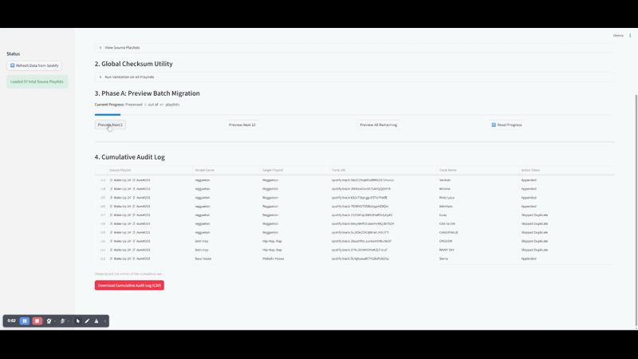

# Aum.Music - Spotify ETL Pipeline & Season Aggregator 🎧

## 🎵 About the Aum.Music Project
Aum.Music is a comprehensive music curation project that has been running continuously for 298 weeks.
Every week, I scan all new releases from the artists I follow, filter out full albums and duplicate versions, and listen to approximately 500 new tracks. From these, I meticulously handpick the top 10 to 40 tracks and release them as a weekly Spotify playlist.

To maintain strict organization, I document the exact genres and track counts for each genre within the description of every weekly playlist (e.g., `♩ Indie Pop 5 ♩ Afrobeat 5`).

## 📌 The Challenge
Every 100 weeks marks the end of a "season" in the project. At the end of a season, thousands of tracks from the 100 weekly playlists need to be aggregated and re-sorted into 9 massive "Master Playlists" categorized by genre (e.g., Israeli Music, Hip Hop, Melodic House, etc.).

Sorting this manually is a Sisyphean task highly prone to human error:

*   **Data Inconsistencies:** A single typo made weeks ago in a playlist description (e.g., writing 4 tracks instead of 5) causes the migration script to lose sync, leading to genre "spillover" (e.g., Hip Hop tracks ending up in Afrobeats).
*   **Duplicates & Genre Overlaps:** Tracks can be cross-categorized (e.g., a "Mizrahi" track accidentally spilling over into the general "Israeli Music" bucket).

## 💡 The Technological Solution
Instead of manual labor, I developed a Python-based automation tool—a dedicated Spotify ETL (Extract, Transform, Load) Pipeline with a Streamlit UI. This system takes the raw end-of-season data, strictly validates its integrity, and performs the sorting safely and accurately.

This tool successfully identified historical typos, improved the accuracy of the master playlists by dozens of percentages, and saved hours of manual data entry.

## ⚙️ Key Features
*   **🔍 Global Checksum Validator:** With a single click, the system scans all 100+ cached playlists. It parses the text descriptions, sums the declared track counts, and compares the expected sum to the actual physical track count in the playlist. It clearly flags mismatches (`✅ OK` / `❌ Mismatch`), allowing me to fix data in Spotify before executing the migration.
*   **🛡️ Mutual Exclusion Engine:** A smart routing algorithm that ensures hermetic separation between sub-genres. For example, it automatically blocks tracks identified as "Mizrahi" or "Israeli Hip Hop" from being appended to the broader "Israeli Music" master playlist.
*   **🚦 Controlled Workflow (Preview -> Approve):** Migrations are not executed blindly. The system runs simulations in batches (e.g., 5 or 10 playlists), displaying a transparent Preview DataFrame showing exactly which track goes to which playlist. Only after human approval does it execute the API POST requests to Spotify.
*   **📦 Backup & Restore (Rollback Plan):** A built-in risk management system. Before any run, it generates a JSON snapshot of all target playlists. In case of an error, a single "Danger" button safely wipes and restores the Spotify playlists to their exact previous state handling API rate limits natively.
*   **🧹 Cross-Playlist Cleanup Utility:** An isolated helper tool to dynamically detect, verify, and delete overlapping tracks between any two given playlists to maintain pristine curation.
*   **📥 DLQ (Dead Letter Queue) Routing:** Any tracks with unmapped or unrecognized genres are automatically routed to a designated "Triage/Catch-All" playlist for manual review, ensuring zero data loss.

## 📸 Screenshots



## 🛠️ Tech Stack
*   **Python 3**
*   **Streamlit:** For building the 3-tab interactive dashboard, managing Session State, and providing visual feedback (DataFrames, Progress Bars).
*   **Spotipy:** For interacting with the Spotify Web API, handling OAuth2 Authentication, fetching paginated playlists, and chunking API requests to avoid `429 Too Many Requests` errors.
*   **Pandas:** For structuring audit logs, processing overlapping arrays, and exporting cumulative CSV reports.
*   **Regex (re):** For fault-tolerant parsing of messy, human-typed playlist descriptions.

## 🚀 Installation & Setup

### Prerequisites
*   Python 3.8+
*   A Spotify Developer Account. Go to the [Spotify Developer Dashboard](https://developer.spotify.com/dashboard/), create an app, and get your `Client ID` and `Client Secret`. Set the Redirect URI to `http://localhost:8080`.

### 1. Clone the repository
```bash
git clone https://github.com/YourUsername/aum-music-aggregator.git
cd aum-music-aggregator
```

### 2. Install Dependencies
```bash
pip install streamlit pandas spotipy python-dotenv
```

### 3. Environment Variables
Create a `.env` file in the root directory and add your Spotify credentials:
```env
SPOTIPY_CLIENT_ID='your_spotify_client_id_here'
SPOTIPY_CLIENT_SECRET='your_spotify_client_secret_here'
SPOTIPY_REDIRECT_URI='http://localhost:8080'
```

### 4. Run the Application
```bash
streamlit run app.py
```
The application will launch in your default web browser. On the first run, Spotify will prompt you to authorize the app.
